# MyAgent_1 - 智能AI助手系统

<div align="center">


*一个基于Python和豆包大模型的智能AI助手系统，支持任务拆解、并行执行和智能汇总*

[功能特色](#功能特色) •
[快速开始](#快速开始) •
[项目架构](#项目架构) •
[API文档](#api文档) •
[配置说明](#配置说明)

</div>

---

## 🌟 功能特色

### 🎯 双模式智能交互
- **ChatBot模式**：处理简单对话，如天气查询、时间获取、日常聊天
- **TaskPlanning模式**：智能拆解复杂任务，支持用户确认和编辑

### 🔄 并行任务执行
- **图片生成Agent**：基于豆包文生图API，生成高质量图片
- **文字生成Agent**：处理文本任务、天气查询、时间获取
- **网页搜索Agent**：集成博查AI搜索，获取最新网络信息

### 💾 智能记忆管理
- 持久化对话历史
- 自动生成对话摘要
- 时间戳保护机制

### 🎨 现代化Web界面
- 响应式设计，支持多设备
- 实时消息显示
- Markdown格式支持
- 图片预览功能

## 🚀 快速开始

### 环境要求
- Python 3.8+
- Node.js (用于前端依赖，可选)

### 安装步骤

1. **克隆项目**
```bash
git clone https://github.com/yourusername/myagent_1.git
cd myagent_1
```

2. **安装依赖**
```bash
pip install -r requirements.txt
```

3. **配置环境变量**
```bash
cp .env.example .env
# 编辑 .env 文件，填入你的API密钥
```

4. **启动服务**
```bash
python main.py
```

5. **访问应用**
打开浏览器访问：`http://localhost:8070`

## 🏗️ 项目架构

### 核心组件

```
myagent_1/
├── main.py                 # Flask主应用
├── agent.py                # 核心智能体逻辑
├── task_planning.py        # 任务规划模块
├── task_dispatcher.py      # 任务分配器
├── task_summarizer.py      # 结果汇总器
├── conversation.py         # 对话管理
├── config.py              # 配置管理
├── tools.py               # 工具函数
├── MCP_server/            # MCP服务器
│   ├── photo_generator_server.py    # 图片生成服务
│   ├── text_generator_server.py     # 文字处理服务
│   └── web_search_server.py         # 网页搜索服务
├── utils/                 # 工具模块
│   ├── timestamp_utils.py # 时间戳工具
│   └── message_utils.py   # 消息工具
├── static/                # 前端资源
│   ├── script.js         # 前端逻辑
│   ├── style.css         # 样式文件
│   └── generated_images/ # 生成的图片
├── conversations/         # 对话存储
└── templates/            # HTML模板
    └── index.html
```

### 工作流程

```mermaid
graph TD
    A[用户输入] --> B{问题类型判断}
    B -->|简单问题| C[ChatBot模式]
    B -->|复杂任务| D[TaskPlanning模式]
    
    C --> E[直接回答]
    
    D --> F[任务拆解]
    F --> G[用户确认]
    G --> H[任务分配器]
    
    H --> I[图片生成Agent]
    H --> J[文字生成Agent]
    H --> K[网页搜索Agent]
    
    I --> L[任务汇总器]
    J --> L
    K --> L
    
    L --> M[最终结果]
    E --> N[保存对话]
    M --> N
```



## 📚 API文档

### 核心接口

#### 1. 聊天接口
```http
POST /api/chat
Content-Type: application/json

{
  "message": "用户消息",
  "conversation_id": "对话ID（可选）"
}
```

#### 2. 任务确认接口
```http
POST /api/confirm-tasks
Content-Type: application/json

{
  "conversation_id": "对话ID",
  "tasks": ["任务1", "任务2"],
  "original_question": "原始问题",
  "modified_todo_content": "修改后的TODO内容"
}
```

#### 3. 对话管理接口
```http
GET /api/conversations           # 获取对话列表
GET /api/conversation/{id}       # 获取单个对话
POST /api/conversation/new       # 创建新对话
DELETE /api/conversation/{id}    # 删除对话
```

### 响应格式

```json
{
  "response": "AI回复内容",
  "conversation_id": "对话ID",
  "mode": "chatBot|taskPlanning",
  "status": "success|waiting_confirmation|completed"
}
```

## ⚙️ 配置说明

### 环境变量配置

创建 `.env` 文件并配置以下参数：

```bash
# 豆包/字节跳动 API 配置
DOUBAO_API_KEY=your_doubao_api_key
DOUBAO_BASE_URL=https://ark.cn-beijing.volces.com/api/v3
DOUBAO_MODEL=doubao-seed-1-6-flash-250615

# 高德地图 API 配置
GAODE_API_KEY=your_gaode_api_key
GAODE_WEATHER_URL=https://restapi.amap.com/v3/weather/weatherInfo

# 博查AI搜索API配置
BOCHA_API_KEY=your_bocha_api_key
BOCHA_API_URL=https://api.bochaai.com/v1/ai-search

# Flask 配置
FLASK_HOST=0.0.0.0
FLASK_PORT=8070
FLASK_DEBUG=True

# 生成图片保存路径
GENERATED_IMAGES_PATH=static/generated_images
```

### API密钥获取

1. **豆包API**: 访问 [火山引擎](https://www.volcengine.com/) 获取
2. **高德地图API**: 访问 [高德开放平台](https://lbs.amap.com/) 获取
3. **博查AI搜索**: 访问 [博查AI](https://www.bochaai.com/) 获取

## 🛠️ 开发指南

### 添加新的Agent

1. 在 `MCP_server/` 目录下创建新的服务器文件
2. 实现MCP协议规范的工具函数
3. 在 `task_dispatcher.py` 中注册新的Agent
4. 更新任务分类逻辑

### 自定义工具

```python
@app.tool()
async def your_custom_tool(param: str) -> str:
    """
    自定义工具描述
    
    Args:
        param: 参数描述
    
    Returns:
        返回结果的JSON字符串
    """
    # 实现你的逻辑
    return json.dumps({"status": "success", "result": "结果"})
```

### 前端扩展

前端基于原生JavaScript开发，支持：
- Markdown渲染
- 图片预览
- 实时消息
- 响应式布局

## 🔧 故障排除

### 常见问题

1. **API密钥错误**
   - 检查 `.env` 文件配置
   - 确认API密钥有效性

2. **端口占用**
   - 修改 `FLASK_PORT` 环境变量
   - 或终止占用端口的进程

3. **MCP连接失败**
   - 检查Python环境和依赖
   - 查看服务器日志信息

4. **图片无法显示**
   - 确认 `GENERATED_IMAGES_PATH` 配置
   - 检查文件权限设置

### 调试模式

启用详细日志：
```bash
export FLASK_DEBUG=True
python main.py
```

## 🤝 贡献指南

欢迎提交Issue和Pull Request！

1. Fork本项目
2. 创建特性分支 (`git checkout -b feature/AmazingFeature`)
3. 提交更改 (`git commit -m 'Add some AmazingFeature'`)
4. 推送到分支 (`git push origin feature/AmazingFeature`)
5. 创建Pull Request

## 📄 许可证

本项目基于 MIT 许可证开源 - 查看 [LICENSE](LICENSE) 文件了解详情

## 👨‍💻 作者

**郭桓君** - [GitHub](https://github.com/yourusername)

## 🙏 致谢

- [豆包大模型](https://www.volcengine.com/) - 核心AI能力
- [Model Context Protocol](https://modelcontextprotocol.io/) - 智能体通信协议
- [Flask](https://flask.palletsprojects.com/) - Web框架
- [高德地图API](https://lbs.amap.com/) - 天气服务
- [博查AI](https://www.bochaai.com/) - 搜索服务

---

<div align="center">

**如果这个项目对你有帮助，请给个 ⭐️ Star 支持一下！**

</div>